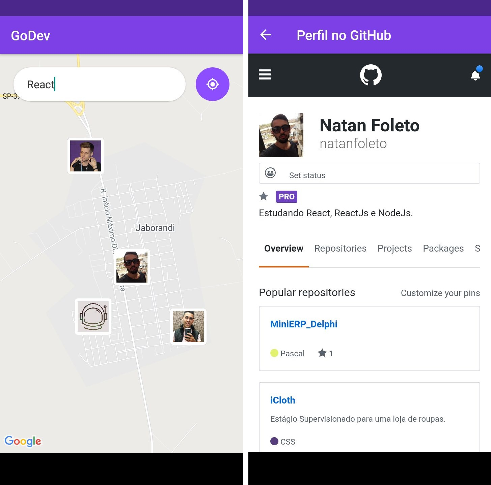

# GoDev
> Faça com que sua busca por desenvolvedores mais próximos, e que trabalham com a mesma tecnologia que você, seja mais simples e rapido possivel!!

Fotografia 1 – Aplicação web em sua primeira versão


Fotografia 2 – Aplicação mobile em sua primeira versão



## Installation

Windows & MacOS:

```sh
npm install
```

Ubuntu:

```sh
sudo npm install
```

## Usage example

Após baixar e instalar os node_modules, seu aplicativo está pronto pra ser iniciado.

Back-end:
_With [yarn][yarn]._
```sh
yarn dev
```
_No yarn_
```sh
npm dev
```

Front-end:
```sh
npm start
```

Mobile:
```sh
npm start
```
_Ou_
```sh
expo start
```

## Meta

Natan Foleto – [@linkedin](https://www.linkedin.com/in/natan-foleto-9bbb2b178/) – natanfoleto2015@hotmail.com

Distributed under the XYZ license. See ``LICENSE`` for more information.

[https://github.com/natanfoleto](https://github.com/natanfoleto/)

<!-- Markdown link & img dfn's -->
[yarn]: https://yarnpkg.com
[linkedin]: https://www.linkedin.com/in/natan-foleto-9bbb2b178/
